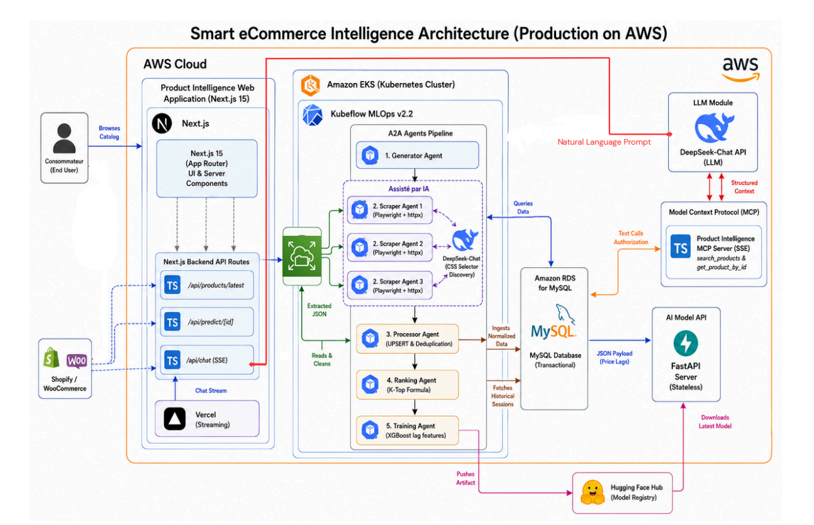

# 🧠 Product Intelligence — Kubeflow ML Pipeline

> A production-ready, AI-assisted data pipeline that automatically scrapes e-commerce product data, cleans and stores it, ranks products using a composite scoring algorithm, and trains a price-trend prediction model — fully orchestrated on **Kubeflow Pipelines** running on **Kubernetes**.

> ⚠️ **This repository is one part of a larger, full-stack product intelligence platform.** It handles the data collection, processing, and ML training pipeline only. The complete system also includes a consumer-facing web application, an MCP server for AI-powered querying, and a price prediction inference API. See the [Related Repositories](#-related-repositories) section for the full picture.

---

## 📖 Table of Contents

1. [Project Objective](#-project-objective)
2. [Technology Stack](#-technology-stack)
3. [Architecture Overview](#-architecture-overview)
4. [Pipeline Orchestration (Kubeflow DAG)](#-pipeline-orchestration-kubeflow-dag)
5. [Agent Reference](#-agent-reference)
   - [Generator Agent](#1-generator-agent)
   - [Scraper Agent](#2-scraper-agent-ai-assisted)
   - [Processor Agent](#3-processor-agent)
   - [Ranking Agent](#4-ranking-agent)
   - [Training Agent](#5-training-agent)
6. [Database Schema](#-database-schema)
7. [Ranking Score Formula](#-ranking-score-formula)
8. [ML Model: Price Trend Prediction](#-ml-model-price-trend-prediction)
9. [Deployment Guide](#-deployment-guide)
10. [Project Structure](#-project-structure)
11. [Environment Variables](#-environment-variables)
12. [Related Repositories](#-related-repositories)

---

## 🎯 Project Objective

The goal of **Product Intelligence** is to build a fully automated **MLOps pipeline** that:

1. **Collects** up-to-date product data (price, stock, ratings) from real e-commerce stores across multiple categories (Phones, PCs, Chargers).
2. **Cleans and normalizes** the data and stores it in a relational MySQL database with historical versioning (session-based).
3. **Ranks** products within each category using a multi-factor composite score, enabling "k-top" product recommendations.
4. **Trains** a machine learning model to **predict future price trends** (RISE / STABLE / DROP) using time-series features.
5. **Exports** the trained model to the **Hugging Face Hub** for integration into downstream applications or inference APIs.

Every step runs as an **isolated container** on Kubernetes, scheduled and monitored by **Kubeflow Pipelines**.

---

## 🛠️ Technology Stack

| Layer               | Technology                                                                 |
|---------------------|----------------------------------------------------------------------------|
| **Orchestration**   | Kubeflow Pipelines v2.2 on kubernetes in prod and minikube in dev               |
| **Containerization**| Docker, `mcr.microsoft.com/playwright:v1.42.0-jammy` base image            |
| **Browser Automation** | Playwright (asynchronous Chromium)                                      |
| **AI / LLM**        | DeepSeek-Chat via OpenAI-compatible SDK (CSS selector & data extraction)   |
| **HTTP Client**     | `httpx` (async, for fast bulk harvesting)                                  |
| **HTML Parsing**    | BeautifulSoup4                                                              |
| **Database**        | MySQL 8 (PyMySQL driver, DictCursor)                                       |
| **ML Framework**    | XGBoost (`multi:softprob` multiclass classifier)                           |
| **Data Processing** | Pandas, NumPy, Scikit-Learn                                                |
| **Model Registry**  | Hugging Face Hub (`huggingface-hub`)                                       |
| **Infra-as-code**   | Kubernetes YAML manifests, KFP Python SDK                                 |
| **Fast Installer**  | `uv` (Rust-based pip replacement for Docker builds)                        |

---

## 🏗️ Architecture Overview



---

## 🚦 Pipeline Orchestration (Kubeflow DAG)

The pipeline is defined in `src/pipeline/kfp_pipeline.py` using the **KFP v2 Python SDK** and compiled to `product_intel_pipeline.yaml`.

### Key DAG Design Decisions

| Decision | Reason |
|---|---|
| `ParallelFor` wrapped in a **sub-pipeline** (`scraping-group`) | KFP v2 / Argo forbids a root-level task from using `.after()` on a task *inside* a loop. The sub-pipeline pattern solves the `invalid dependency for-loop-1` error. |
| Scrapers save to **PVC files**, not directly to MySQL | Allows fully stateless parallel containers — each scraper writes its own isolated JSON file. The Processor performs the single, serialized database write. |
| Secrets injected via `kubernetes.use_secret_as_env()` | Keeps credentials out of the pipeline YAML and Docker image. |
| `imagePullPolicy` defaults to `IfNotPresent` with local builds | Built with `eval $(minikube docker-env)` to avoid needing a registry. |

---

## 🤖 Agent Reference

### 1. Generator Agent
**File:** `src/agents/generator_agent.py`

The **entry point** of the pipeline. It generates the static list of e-commerce targets to scrape.

**Output:** A Python `List[Dict]` serialized as JSON, consumed by the `ParallelFor` loop.

```python
targets = [
    { "nom_boutique": "Blackview",      "url": "...",  "platform": "shopify", "category": "phones"   },
    { "nom_boutique": "Techsavers",     "url": "...",  "platform": "shopify", "category": "pcs"      },
    { "nom_boutique": "Rolling Square", "url": "...",  "platform": "shopify", "category": "chargers" },
]
```

**KFP Integration:** When invoked by Kubeflow, it accepts `--json <output_file_path>` as arguments, writing the JSON list to the KFP artifact output path so it can be passed to the next step.

---

### 2. Scraper Agent (AI-Assisted)
**File:** `src/agents/scraper_agent.py`

The most sophisticated agent. It uses a **3-phase "Reconnaissance → Scout → Harvest"** pattern powered by **Playwright** for JS rendering and **DeepSeek AI** for CSS selector inference.

**KFP Arguments:**
```
python3 src/agents/scraper_agent.py --boutique "Blackview" --url "https://..." --category "phones" --platform "shopify"
```

#### Phase 1 — Catalogue Extractor
- Opens the category page using **Playwright** (headless Chromium with full JS support).
- Sends the cleaned HTML to **DeepSeek** via a prompt, asking it to identify the CSS selector that targets all product detail links (`<a>` tags pointing to PDPs).
- Falls back to `a[href*='/products/']` if the LLM fails.
- Returns a deduplicated list of product URLs.

#### Phase 2 — Scout Analysis (The "Reconnaissance" Pattern)
Navigates to the **first product page** (using Playwright) and performs **two parallel analyses:**

| Sub-Phase | Technique | Goal |
|---|---|---|
| **2A — Network Interception** | Playwright `page.on("response")` hook captures all XHR/Fetch calls | Finds any Reviews/Ratings **API endpoint**, extracts a reusable URL template with `{PRODUCT_ID}` placeholder |
| **2B — HTML Structural Analysis** | Sends cleaned HTML to DeepSeek | Discovers stable CSS selectors for: name, price, description, product_id, stars, stock |

This phase runs **once** and produces a `scout_config` dict reused by all subsequent pages.

#### Phase 3 — The Harvester (Fast-Track)
Processes **all remaining product URLs** using `httpx.AsyncClient` (no full browser needed — much faster). For each URL:

1. Applies the **CSS selectors** from the Scout Config.
2. Falls back to **Meta Tags** (`og:title`, `product:price:amount`, etc.) if selectors fail.
3. Falls back to **JSON-LD structured data** as a final layer.
4. Uses the **Reviews API template** (from Phase 2A) to fetch ratings for each product via its product_id.

**Output:** Saves results as `scraped_{boutique}_{category}.json` in the shared PVC at `/app/data/`.

---

### 3. Processor Agent
**File:** `src/agents/processor_agent.py`

The **data integration gateway**. Runs after all scrapers have finished (fan-in synchronization point).

**Responsibilities:**

1. **`setup_database()`** — Creates the normalized MySQL database schema if it doesn't exist yet:
   - `scraping_sessions`: Timestamp of each pipeline run.
   - `scraped_products`: Product metadata (unique by URL via `UNIQUE KEY`).
   - `product_scores`: Historical snapshot of price/ratings/stock per session (linked by FKs).

2. **`clean_and_aggregate_data()`** — Reads all `*.json` files from the PVC, deduplicates by URL, and normalizes prices to USD (GBP × 1.25, EUR × 1.08).

3. **`save_to_mysql()`** — Uses an **UPSERT strategy** (`ON DUPLICATE KEY UPDATE`) for products to avoid duplicates, then inserts a new price snapshot into `product_scores` linked to the current session ID.

> ⚠️ **Note:** A new session row is inserted on every pipeline run. Running the pipeline twice on the same day will create two separate sessions and score entries.

---

### 4. Ranking Agent
**File:** `src/agents/ranking_agent.py`

Calculates a **composite quality score** for each product in the latest scraping session.

It queries the most recent `session_id` and updates the `score` column in `product_scores` for each product using a 3-factor weighted formula (see [Ranking Score Formula](#-ranking-score-formula)).

Scores are normalized **within each category** to ensure fair comparison (e.g., phone prices vs. charger prices don't interfere).

---

### 5. Training Agent
**File:** `src/agents/train_price_trend_model.py`

The final step of the pipeline: **trains a multiclass price-trend classifier** and publishes it.

#### Data Extraction
Fetches the full price history from MySQL (`product_scores` joined with `scraping_sessions`) ordered chronologically by product.

#### Feature Engineering
Creates time-series lag features per product:

| Feature | Description |
|---|---|
| `prix_usd` | Current price |
| `prix_lag_1` | Price from the previous session |
| `prix_lag_3` | Price from 3 sessions ago |
| `prix_lag_7` | Price from 7 sessions ago |
| `volatilite_7j` | Rolling 7-session price standard deviation |

#### Target Variable
The model predicts the **price direction at J+7 (7 sessions ahead)**:

| Class | Label | Condition |
|---|---|---|
| `0` | 📉 DROP | Future price < Current price by > 1% |
| `1` | ➡️ STABLE | Variation within ±1% |
| `2` | 📈 RISE | Future price > Current price by > 1% |

#### Model & Training
- **Algorithm:** `XGBClassifier` with `multi:softprob` objective (3 classes).
- **Split:** Temporal (80% past / 20% most recent data) — no random shuffling to prevent data leakage.
- **Export:** Saved as `models/xgboost_trend_model.pkl` using `joblib`.
- **Publish:** Uploaded to [JunaidUTH/product-price-evolution](https://huggingface.co/JunaidUTH/product-price-evolution) on Hugging Face Hub via the `HfApi`.

---

## 🗄️ Database Schema

```sql
-- Tracks each pipeline run (one row per execution)
scraping_sessions (
    id           INT AUTO_INCREMENT PRIMARY KEY,
    date_session DATETIME DEFAULT CURRENT_TIMESTAMP
)

-- Product catalog (deduplicated by URL)
scraped_products (
    id          INT AUTO_INCREMENT PRIMARY KEY,
    boutique    VARCHAR(100),
    categorie   VARCHAR(100),
    nom         TEXT,
    description TEXT,
    lien        TEXT,        -- URL of the product page
    product_id  VARCHAR(100),
    UNIQUE KEY unique_prod_url (lien(255))
)

-- Historical price/score snapshots (one row per product per session)
product_scores (
    id             INT AUTO_INCREMENT PRIMARY KEY,
    product_id     INT,        -- FK → scraped_products.id
    session_id     INT,        -- FK → scraping_sessions.id
    prix_original  VARCHAR(100),
    prix_usd       FLOAT,
    note_etoiles   FLOAT,
    nombre_avis    INT,
    stock          VARCHAR(100),
    score          FLOAT DEFAULT NULL,   -- Populated by Ranking Agent
    FOREIGN KEY (product_id) REFERENCES scraped_products(id) ON DELETE CASCADE,
    FOREIGN KEY (session_id) REFERENCES scraping_sessions(id) ON DELETE CASCADE
)
```

---

## 📊 Ranking Score Formula

The **Ranking Agent** computes a quality score in `[0, 1]` for each product within its category:

```
Score = (norm_rating × 0.40) + (norm_price × 0.35) + (stock_score × 0.25)
```

| Component | Weight | Calculation |
|---|---|---|
| `norm_rating` | **40%** | `rating / 5.0` (defaults to 4.1/5 if missing) |
| `norm_price` | **35%** | `1 - (price / max_price_in_category)` — lower price = higher score |
| `stock_score` | **25%** | `1.0` if "in stock" / "available", `0.0` if out of stock |

> Normalization is applied **per category** so that phone prices and charger prices don't distort each other's scores.

---

## 🤖 ML Model: Price Trend Prediction

```
Input Features (per product, per session):
    prix_usd, prix_lag_1, prix_lag_3, prix_lag_7, volatilite_7j

                    ┌──────────────────┐
                    │  XGBClassifier   │
                    │  n_estimators=100│
                    │  max_depth=5     │
                    │  lr=0.1          │
                    └────────┬─────────┘
                             │
              ┌──────────────┼──────────────┐
              ▼              ▼              ▼
         📉 DROP (0)   ➡️ STABLE (1)  📈 RISE (2)
```

The model is **retrained on every pipeline run**, ensuring it always reflects the latest market data.

**Published model:** [`JunaidUTH/product-price-evolution`](https://huggingface.co/JunaidUTH/product-price-evolution)

---

## 🚀 Deployment Guide & DevOps

This project supports two primary modes of operation:
1. **Development Mode (Local)**: Runs locally on Minikube.
2. **Production Mode (AWS Cloud)**: Runs on Amazon EKS using Terraform.

### 🔄 DevOps & CI/CD Pipeline
We have integrated a full **GitOps / CI/CD pipeline** using GitHub Actions (`.github/workflows/pipeline-ci.yml`). 
Whenever new code is pushed to the `main` branch, the pipeline automatically:
1. Builds a fresh Docker image containing your updated Agent code.
2. Tags the image dynamically using the Git commit hash.
3. Pushes the image to **DockerHub**.
4. Re-compiles the `product_intel_pipeline.yaml` using the new Docker image tag and commits it back to the repository.

*You no longer need to manually build or update Docker image names. Just push your code, wait 60 seconds, and your new YAML is ready for Kubeflow!*

---

### ☁️ Production Mode (AWS Cloud)

> **💡 Budget Architecture Note:** To optimize costs, only the core **Kubernetes Cluster (EKS)** and the **MySQL Database (RDS)** are currently hosted inside AWS. In a full-potential enterprise scenario, all external components (like Model Serving, Image Registries, and AI APIs) would also be migrated natively into the AWS ecosystem.


#### 1. Build the Infrastructure
Navigate to the `terraform/` directory. The Terraform scripts will automatically provision:
- A secure AWS VPC.
- A minimalist EKS Cluster (`t3.large` nodes).
- An EFS Shared Network Drive (for parallel scraping).
- An RDS MySQL Database (`db.t3.micro`).

```bash
cd terraform/
terraform init
terraform apply
```
*(Terraform will output your `rds_endpoint` and `rds_password` at the end).*

#### 2. Apply Secrets Securely
1. Open `k8s/secrets.yaml` and replace the placeholder values with your real API keys and the new **RDS credentials**.
2. Run the command to inject them into the cluster:
   ```bash
   kubectl apply -f k8s/secrets.yaml
   ```
3. **CRITICAL:** Press `CTRL+Z` in your code editor or run `git restore k8s/secrets.yaml` to revert the file to fake placeholders so you don't leak passwords to GitHub.

#### 3. Post-Cluster Setup
Once the cluster is up, apply your cloud storage configuration and install Kubeflow Pipelines Standalone:
```bash
# Attach the AWS EFS storage
kubectl apply -f k8s/vols2.yaml

# Install Lightweight Kubeflow Pipelines
export PIPELINE_VERSION=2.4.1
kubectl apply -k "github.com/kubeflow/pipelines/manifests/kustomize/cluster-scoped-resources?ref=$PIPELINE_VERSION"
kubectl wait --for condition=established --timeout=60s crd/applications.app.k8s.io
kubectl apply -k "github.com/kubeflow/pipelines/manifests/kustomize/env/dev?ref=$PIPELINE_VERSION"
```

#### 4. Run the Pipeline
Port-forward the UI to your local machine (since the cloud cluster is private):
```bash
kubectl port-forward -n kubeflow svc/ml-pipeline-ui 8080:80
```
Open `http://localhost:8080`, upload the `product_intel_pipeline.yaml`, and start a run!

---

### 💻 Development Mode (Local Minikube)

#### Prerequisites
- Minikube running with Kubeflow Pipelines installed
- Docker available
- MySQL accessible from Minikube (local or in-cluster)

#### Step 1 – Apply Storage & Secrets
```bash
kubectl apply -f k8s/vols.yaml
kubectl apply -f k8s/secrets.yaml # Edit with your local DB credentials first!
```

#### Step 2 – Upload & Run on Kubeflow
1. Open the **Kubeflow Central Dashboard** in your browser.
2. Navigate to **Pipelines → Upload Pipeline**.
3. Upload `product_intel_pipeline.yaml` (which is auto-generated by the CI/CD pipeline).
4. Click **Create Run** and watch the DAG execute in real-time.

---

## 📁 Project Structure

```
product-intelligence/
├── Dockerfile                        # Multi-stage build using Playwright base + uv installer
├── product_intel_pipeline.yaml       # Compiled KFP pipeline (Argo-compatible YAML)
├── k8s/
│   └── vols.yaml                     # PersistentVolume + PersistentVolumeClaim manifests
├── models/
│   └── xgboost_trend_model.pkl       # Trained model artifact (generated at runtime)
└── src/
    ├── .env                          # Local development environment variables
    ├── requirements.txt              # Python dependencies
    ├── pipeline/
    │   └── kfp_pipeline.py          # KFP v2 pipeline definition & compiler
    └── agents/
        ├── database_utils.py         # Shared MySQL connection factory (DictCursor)
        ├── generator_agent.py        # Step 1: Produces list of scraping targets
        ├── scraper_agent.py          # Step 2: AI-assisted 3-phase web scraper
        ├── processor_agent.py        # Step 3: Data cleaning, normalization, DB insert
        ├── ranking_agent.py          # Step 4: Composite score calculation
        └── train_price_trend_model.py# Step 5: XGBoost training + HF upload
```

---

## 🔐 Environment Variables

| Variable | Used By | Description |
|---|---|---|
| `MYSQL_HOST` | Processor, Ranking, Training | MySQL host (in dev :, `host.minikube.internal` in prod u can get the password of the database when the terraform stack is deployed) |
| `MYSQL_USER` | Processor, Ranking, Training | MySQL username |
| `MYSQL_PASSWORD` | Processor, Ranking, Training | MySQL password |
| `MYSQL_DATABASE` | Processor, Ranking, Training | Target database name |
| `DATA_DIR` | Scraper, Processor | Path to shared PVC mount (in dev : `/app/data`, in prod u can use EFS) |
| `DEEPSEEK_API_KEY` | Scraper | API key for DeepSeek LLM |
| `DEEPSEEK_BASE_URL` | Scraper | DeepSeek endpoint (default: `https://api.deepseek.com`) |
| `HF_TOKEN` | Training | Hugging Face write token |
| `HF_REPO_ID` | Training | Target HF model repository (e.g., `JunaidUTH/product-price-evolution`) |

---

## 🔗 Related Repositories

This pipeline is the **data & ML backbone** of a larger product intelligence platform. Here are the companion repositories that complete the full system:

| Repository | Description |
|---|---|
| [**product-intelligence-web-application**](https://github.com/JunaidUthman/product-intelligence-web-application) | Consumer-facing Next.js web app — product explorer, price history charts, and AI chatbot powered by the MCP server |
| [**product-intelligence-mcp-server**](https://github.com/JunaidUthman/product-intelligence-mcp-server) | Model Context Protocol (MCP) server exposing a `search_products_scored_by_AI` tool that translates natural language queries into SQL and returns structured product data |
| [**price-evolution-ml-model-api**](https://github.com/JunaidUthman/price-evolution-ml-model-api) | FastAPI inference server that loads the XGBoost price-trend model from Hugging Face Hub and serves real-time price-direction predictions (`DROP` / `STABLE` / `RISE`) |

---

## 📄 License

This project is for educational and research purposes. All scraped data is used solely for price intelligence analysis.
